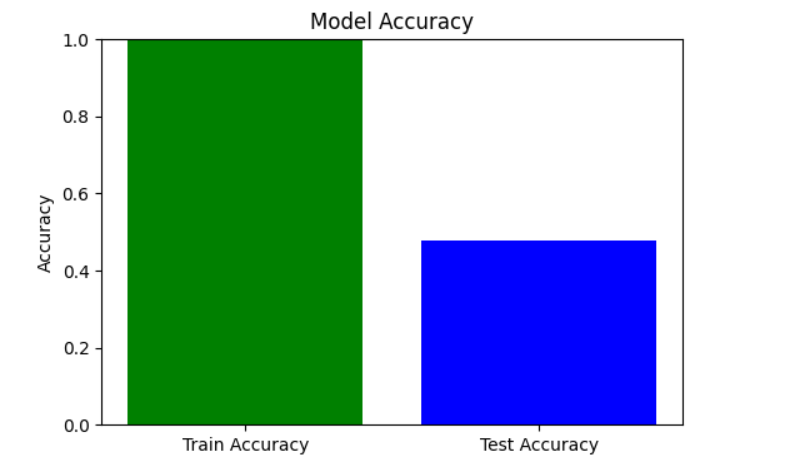

 Emergency Response System: Drone & Ambulance Coordination
This project presents an AI-driven Emergency Response System that predicts whether a drone, ambulance, or both should be dispatched to an emergency site, based on a range of contextual factors like weather, traffic, incident severity, etc.

 Dataset Columns
The dataset includes the following features:

Incident_Severity

Incident_Type

Region_Type

Traffic_Congestion

Weather_Condition

Drone_Availability

Ambulance_Availability

Battery_Life

Air_Traffic

Response_Time

Hospital_Capacity

Distance_to_Incident

Number_of_Injuries

Specialist_Availability

Road_Type

Emergency_Level

Drone_Speed

Ambulance_Speed

Payload_Weight

Fuel_Level

Weather_Impact

Dispatch_Coordinator

Label ← (Target column: Drone, Ambulance, Both)
 Model Pipeline
The pipeline follows these steps:

Data Loading

Preprocessing

Encoding categorical variables

Feature scaling

Handling missing values

Train/Test Split

Model Training using RandomForestClassifier

Prediction

Evaluation: accuracy, confusion matrix

Real-time prediction support with an input dictionary

Final result visualization using LIVE.png
 Requirements
Install dependencies:

bash
Copy
Edit
pip install pandas scikit-learn matplotlib seaborn
 Output Screenshot
Here is the model's live prediction output:

 Screenshot Result:

 Sample Real-Time Prediction
You can test a real-time prediction using the following example:

python
Copy
Edit
input_data = {
    'Incident_Severity': 'High',
    'Incident_Type': 'Fire',
    'Region_Type': 'Urban',
    'Traffic_Congestion': 'High',
    'Weather_Condition': 'Rainy',
    'Drone_Availability': 'Yes',
    'Ambulance_Availability': 'Yes',
    'Battery_Life': 80,
    'Air_Traffic': 'Moderate',
    'Response_Time': 15,
    'Hospital_Capacity': 'Full',
    'Distance_to_Incident': 5.0,
    'Number_of_Injuries': 3,
    'Specialist_Availability': 'Yes',
    'Road_Type': 'Highway',
    'Emergency_Level': 'Critical',
    'Drone_Speed': 70,
    'Ambulance_Speed': 60,
    'Payload_Weight': 5,
    'Fuel_Level': 60,
    'Weather_Impact': 'Medium',
    'Dispatch_Coordinator': 'Alice'
}
 Prediction:
Service Required: Both

 How to Run
bash
Copy
Edit
python emergency_response_model.py
Or run all cells in the Jupyter notebook to interactively explore the process.

📌 Author
Sagnik Patra
M.Tech | IIIT Trichy
